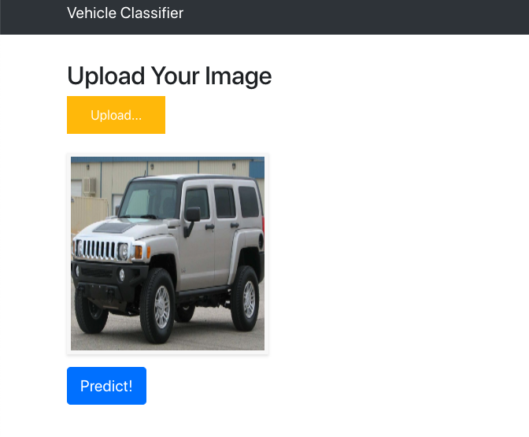
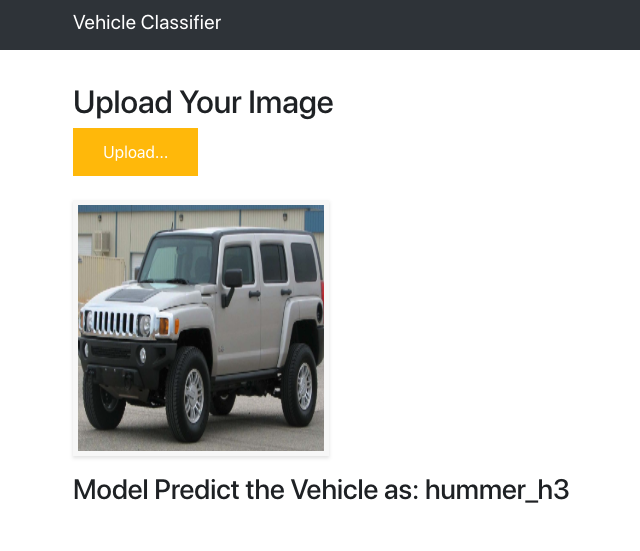

# Deploy vehicle classifier using flask on heroku

> This is a web application that has been developed using the fastai library and is deployed on heroku. The application takes thousands of images from the VMMRdb dataset and classifies to the make and model level of vehicles between 1990 and 2012. There are just under 400 different categories of vehicles and the model sports a 91% accuracy level trained on a GTX 1060i GPU. 

------------------

Demo:

  

------------------

  

------------------

## Getting started

- Fork and clone this repo on to your system

## Customization

### Put your model inside path/models folder

- Place your trained `.pth` file under path/models/ directory.

### Change the class and path name

- Open "app.py" and search for a variable called classes and change that with your own classes

- If your path name is different that "stage-2.pth", then change the learn.load("with_your_file_name.pth") in "app.py"

### UI Change

Modify files in `templates` and `static` directory.

`index.html` for the UI and `main.js` for all the behaviors

## Heroku Installation

- Make sure that heroku is installed on your system, if you want to install then follow this https://devcenter.heroku.com/articles/heroku-cli#download-and-install

- Go to https://www.heroku.com/ then login or signup into heroku.

- Once you are logged in, you will have to click on new and click on create a new app as given in the screenshot below

  

- Give your app name and click on create app

- Go to the folder where you have cloned my repo and follow the steps given on the page

- Once you are done, you will see the link to check your app on browser like this https://water-classifier1.herokuapp.com/

> Note: If App is showing Application error then refresh the browser,It will work fine.

## Future Roadmap
- Create a custom domain name
- Use SSL certs
- Add unit test.
- Add CI/CD integration.
- Create a robust image classifier using the more data or using some advance technique.
- Adding celery and redis as a message brocker to handle the long task.

